# Diagrama de Casos de Uso

Este diagrama representa os principais casos de uso do sistema e os atores envolvidos.

```mermaid
graph TB
    %% Atores
    subgraph Atores
        U[👤 Usuário<br/>Não Autenticado]
        P[👤 Professor]
        C[👤 Criador de Conteúdo]
        E[👤 Estudante]
        A[🤖 Sistema de IA<br/>OpenAI/Gemini]
        S[☁️ Cloudflare R2]
    end
    
    %% Casos de Uso - Autenticação
    subgraph "Autenticação e Registro"
        UC1[Registrar Conta]
        UC2[Fazer Login]
        UC3[Login com Google OAuth]
        UC4[Gerenciar Perfil]
        UC5[Excluir Conta]
    end
    
    %% Casos de Uso - Documentos
    subgraph "Gestão de Documentos"
        UC6[Upload de Documento]
        UC7[Listar Documentos]
        UC8[Visualizar Detalhes]
        UC9[Excluir Documento]
        UC10[Processar Documento]
        UC11[Gerar Embeddings]
    end
    
    %% Casos de Uso - Questões
    subgraph "Geração de Questões"
        UC12[Selecionar Níveis Cognitivos]
        UC13[Gerar Questões]
        UC14[Visualizar Questões]
        UC15[Editar Questão]
        UC16[Excluir Questão]
        UC17[Exportar Questões]
    end
    
    %% Casos de Uso - RAG
    subgraph "Consultas RAG"
        UC18[Testar Consulta]
        UC19[Visualizar Chunks Recuperados]
        UC20[Ver Scores de Similaridade]
    end
    
    %% Casos de Uso - Feedback
    subgraph "Feedback e Qualidade"
        UC21[Avaliar Questão]
        UC22[Fornecer Feedback Detalhado]
        UC23[Visualizar Badges de Qualidade]
        UC24[Ver Análise de Feedback]
    end
    
    %% Casos de Uso - Storage
    subgraph "Gestão de Storage"
        UC25[Verificar Uso de Storage]
        UC26[Visualizar Limites]
        UC27[Gerenciar Arquivos]
    end
    
    %% Relacionamentos - Autenticação
    U -->|registra| UC1
    U -->|autentica| UC2
    U -->|autentica| UC3
    P -->|gerencia| UC4
    C -->|gerencia| UC4
    E -->|gerencia| UC4
    P -->|exclui| UC5
    C -->|exclui| UC5
    E -->|exclui| UC5
    
    %% Relacionamentos - Documentos
    P -->|faz upload| UC6
    C -->|faz upload| UC6
    E -->|faz upload| UC6
    P -->|visualiza| UC7
    C -->|visualiza| UC7
    E -->|visualiza| UC7
    P -->|visualiza| UC8
    C -->|visualiza| UC8
    E -->|visualiza| UC8
    P -->|exclui| UC9
    C -->|exclui| UC9
    E -->|exclui| UC9
    
    %% Relacionamentos - Questões
    P -->|seleciona| UC12
    C -->|seleciona| UC12
    E -->|seleciona| UC12
    P -->|gera| UC13
    C -->|gera| UC13
    E -->|gera| UC13
    P -->|visualiza| UC14
    C -->|visualiza| UC14
    E -->|visualiza| UC14
    P -->|edita| UC15
    C -->|edita| UC15
    P -->|exclui| UC16
    C -->|exclui| UC16
    P -->|exporta| UC17
    C -->|exporta| UC17
    E -->|exporta| UC17
    
    %% Relacionamentos - RAG
    P -->|testa| UC18
    C -->|testa| UC18
    P -->|visualiza| UC19
    C -->|visualiza| UC19
    P -->|visualiza| UC20
    C -->|visualiza| UC20
    
    %% Relacionamentos - Feedback
    P -->|avalia| UC21
    C -->|avalia| UC21
    E -->|avalia| UC21
    P -->|fornece| UC22
    C -->|fornece| UC22
    E -->|fornece| UC22
    P -->|visualiza| UC23
    C -->|visualiza| UC23
    E -->|visualiza| UC23
    P -->|visualiza| UC24
    C -->|visualiza| UC24
    
    %% Relacionamentos - Storage
    P -->|verifica| UC25
    C -->|verifica| UC25
    E -->|verifica| UC25
    P -->|visualiza| UC26
    C -->|visualiza| UC26
    E -->|visualiza| UC26
    P -->|gerencia| UC27
    C -->|gerencia| UC27
    E -->|gerencia| UC27
    
    %% Relacionamentos - Sistema
    UC6 -.->|armazena| S
    UC9 -.->|remove de| S
    UC10 -.->|processa| A
    UC11 -.->|gera com| A
    UC13 -.->|gera com| A
    
    %% Extends e Includes
    UC6 -->|<<include>>| UC10
    UC10 -->|<<include>>| UC11
    UC13 -->|<<include>>| UC18
    UC21 -->|<<extend>>| UC22
    
    style U fill:#e1f5ff
    style P fill:#fff4e1
    style C fill:#ffe1f5
    style E fill:#e1ffe1
    style A fill:#f0f0f0
    style S fill:#f0f0f0
```

## Descrição dos Atores

### 👤 Usuário Não Autenticado
- Pessoa que acessa o sistema pela primeira vez
- Pode registrar conta ou fazer login
- Acesso limitado às páginas públicas

### 👤 Professor
- Educador que usa o sistema para preparar avaliações
- Foca em questões de **avaliação** (Taxonomia de Bloom)
- Exporta questões para uso em provas e testes
- Principal caso de uso: **gerar banco de questões para avaliações**

### 👤 Criador de Conteúdo
- Profissional que desenvolve material educacional
- Usa questões de **criação** para brainstorming
- Foca em desenvolver e expandir conteúdo
- Principal caso de uso: **gerar ideias e desenvolver material didático**

### 👤 Estudante
- Aluno que usa o sistema para autoavaliação
- Gera questões de estudo a partir de material
- Testa compreensão do conteúdo
- Principal caso de uso: **praticar e avaliar conhecimento**

### 🤖 Sistema de IA (OpenAI/Gemini)
- Provedor de inteligência artificial externo
- Gera embeddings vetoriais
- Gera questões via prompts especializados
- Pode ser OpenAI GPT ou Google Gemini

### ☁️ Cloudflare R2
- Serviço de armazenamento de objetos
- Armazena documentos enviados pelos usuários
- Compatível com S3
- 300MB por usuário

## Descrição dos Casos de Uso

### 1. Autenticação e Registro

#### UC1: Registrar Conta
**Ator Principal**: Usuário Não Autenticado  
**Descrição**: Cria uma nova conta no sistema com email e senha  
**Pré-condições**: Nenhuma  
**Fluxo Principal**:
1. Usuário acessa página de registro
2. Preenche email, nome e senha
3. Sistema valida dados
4. Sistema cria conta e envia email de verificação
5. Usuário é redirecionado para login

**Pós-condições**: Conta criada no sistema

#### UC2: Fazer Login
**Ator Principal**: Usuário Não Autenticado  
**Descrição**: Autentica no sistema com email e senha  
**Pré-condições**: Ter conta registrada  
**Fluxo Principal**:
1. Usuário acessa página de login
2. Insere email e senha
3. Sistema valida credenciais
4. Sistema cria sessão
5. Usuário é redirecionado para dashboard

**Pós-condições**: Usuário autenticado com sessão ativa

#### UC3: Login com Google OAuth
**Ator Principal**: Usuário Não Autenticado  
**Descrição**: Autentica usando conta Google  
**Pré-condições**: Ter conta Google  
**Fluxo Principal**:
1. Usuário clica em "Login com Google"
2. Sistema redireciona para Google OAuth
3. Usuário autoriza aplicação
4. Sistema recebe tokens e cria/atualiza conta
5. Sistema cria sessão
6. Usuário é redirecionado para dashboard

**Pós-condições**: Usuário autenticado via OAuth

#### UC4: Gerenciar Perfil
**Ator Principal**: Professor, Criador de Conteúdo, Estudante  
**Descrição**: Edita informações do perfil  
**Pré-condições**: Estar autenticado  
**Fluxo Principal**:
1. Usuário acessa página de perfil
2. Edita nome, avatar, etc.
3. Sistema valida alterações
4. Sistema salva alterações

**Pós-condições**: Perfil atualizado

#### UC5: Excluir Conta
**Ator Principal**: Qualquer usuário autenticado  
**Descrição**: Remove conta e todos os dados associados  
**Pré-condições**: Estar autenticado  
**Fluxo Principal**:
1. Usuário acessa configurações
2. Clica em "Excluir Conta"
3. Sistema solicita confirmação
4. Usuário confirma
5. Sistema remove todos os dados (documentos, questões, sessões)

**Pós-condições**: Conta e dados removidos permanentemente

### 2. Gestão de Documentos

#### UC6: Upload de Documento
**Ator Principal**: Professor, Criador de Conteúdo, Estudante  
**Descrição**: Envia documento para processamento  
**Pré-condições**: Estar autenticado, ter espaço disponível  
**Fluxo Principal**:
1. Usuário seleciona arquivo (PDF, DOCX, TXT, MD)
2. Sistema valida arquivo (tipo, tamanho, storage)
3. Sistema faz upload para Cloudflare R2
4. Sistema registra documento no banco
5. Sistema inicia processamento assíncrono (**include UC10**)

**Pós-condições**: Documento armazenado e em processamento

#### UC10: Processar Documento
**Ator Principal**: Sistema (automático)  
**Descrição**: Extrai texto, chunking e gera embeddings  
**Pré-condições**: Documento enviado  
**Fluxo Principal**:
1. Sistema baixa documento do R2
2. Sistema extrai texto (PDF/DOCX/TXT/MD)
3. Sistema divide em chunks (chunking)
4. Sistema gera embeddings para cada chunk (**include UC11**)
5. Sistema marca documento como INDEXED

**Pós-condições**: Documento processado e pronto para gerar questões

#### UC11: Gerar Embeddings
**Ator Principal**: Sistema de IA  
**Descrição**: Gera vetores de embeddings para chunks  
**Pré-condições**: Chunks criados  
**Fluxo Principal**:
1. Sistema envia chunks para provedor de IA
2. Provedor retorna vetores (1536 dimensões)
3. Sistema armazena embeddings no pgvector

**Pós-condições**: Embeddings armazenados para busca semântica

### 3. Geração de Questões

#### UC12: Selecionar Níveis Cognitivos
**Ator Principal**: Professor, Criador de Conteúdo, Estudante  
**Descrição**: Escolhe níveis da Taxonomia de Bloom  
**Pré-condições**: Documento processado  
**Fluxo Principal**:
1. Usuário acessa gerador de questões
2. Seleciona documento
3. Escolhe propósito (Avaliação ou Criação)
4. Marca níveis desejados
5. Define quantidade por nível

**Pós-condições**: Configuração pronta para gerar

#### UC13: Gerar Questões
**Ator Principal**: Professor, Criador de Conteúdo, Estudante  
**Descrição**: Gera questões via IA usando RAG  
**Pré-condições**: Níveis selecionados  
**Fluxo Principal**:
1. Usuário clica "Gerar Questões"
2. Para cada nível, sistema faz consulta RAG (**include UC18**)
3. Sistema envia contexto + prompt para IA
4. IA retorna questões em JSON
5. Sistema valida e armazena questões
6. Sistema calcula dificuldade e extrai evidências

**Pós-condições**: Questões geradas e armazenadas

#### UC17: Exportar Questões
**Ator Principal**: Professor, Criador de Conteúdo, Estudante  
**Descrição**: Exporta questões em JSON ou CSV  
**Pré-condições**: Ter questões geradas  
**Fluxo Principal**:
1. Usuário seleciona questões
2. Escolhe formato (JSON/CSV)
3. Sistema formata questões
4. Sistema gera arquivo
5. Usuário faz download

**Pós-condições**: Arquivo exportado

### 4. Consultas RAG

#### UC18: Testar Consulta
**Ator Principal**: Professor, Criador de Conteúdo  
**Descrição**: Testa busca semântica no documento  
**Pré-condições**: Documento indexado  
**Fluxo Principal**:
1. Usuário acessa RAG Tester
2. Digita consulta em linguagem natural
3. Sistema gera embedding da consulta
4. Sistema busca chunks similares (pgvector)
5. Sistema retorna chunks com scores (**include UC19, UC20**)

**Pós-condições**: Resultados da busca exibidos

#### UC19: Visualizar Chunks Recuperados
**Ator Principal**: Professor, Criador de Conteúdo  
**Descrição**: Visualiza trechos de texto recuperados  
**Pré-condições**: Consulta executada  
**Fluxo Principal**:
1. Sistema exibe lista de chunks
2. Cada chunk mostra conteúdo e posição
3. Usuário pode expandir para ver contexto completo

**Pós-condições**: Chunks visualizados

#### UC20: Ver Scores de Similaridade
**Ator Principal**: Professor, Criador de Conteúdo  
**Descrição**: Visualiza pontuações de relevância  
**Pré-condições**: Consulta executada  
**Fluxo Principal**:
1. Sistema exibe score para cada chunk (0-1)
2. Chunks ordenados por relevância
3. Usuário entende qualidade da recuperação

**Pós-condições**: Scores visualizados

### 5. Feedback e Qualidade

#### UC21: Avaliar Questão
**Ator Principal**: Professor, Criador de Conteúdo, Estudante  
**Descrição**: Fornece feedback (útil/não útil)  
**Pré-condições**: Ter questões geradas  
**Fluxo Principal**:
1. Usuário visualiza questão
2. Clica em 👍 ou 👎
3. Se 👎, sistema solicita razão (**extend UC22**)
4. Sistema armazena feedback

**Pós-condições**: Feedback registrado

#### UC22: Fornecer Feedback Detalhado
**Ator Principal**: Professor, Criador de Conteúdo, Estudante  
**Descrição**: Especifica motivos do feedback negativo  
**Pré-condições**: Avaliou como não útil  
**Fluxo Principal**:
1. Sistema exibe opções de razões
2. Usuário seleciona (fora de contexto, mal formulada, etc.)
3. Usuário pode adicionar comentário
4. Sistema armazena detalhes

**Pós-condições**: Feedback detalhado armazenado para análise

#### UC23: Visualizar Badges de Qualidade
**Ator Principal**: Professor, Criador de Conteúdo, Estudante  
**Descrição**: Vê indicadores de qualidade do documento  
**Pré-condições**: Documento processado  
**Fluxo Principal**:
1. Sistema analisa documento
2. Atribui badges: Alta Cobertura, Estruturado, Denso, Confiável
3. Usuário visualiza badges no card do documento

**Pós-condições**: Badges exibidos

#### UC24: Ver Análise de Feedback
**Ator Principal**: Professor, Criador de Conteúdo  
**Descrição**: Visualiza padrões de feedback negativo  
**Pré-condições**: Ter feedbacks registrados  
**Fluxo Principal**:
1. Sistema analisa feedbacks negativos
2. Agrupa por razão
3. Identifica padrões comuns
4. Exibe estatísticas

**Pós-condições**: Análise visualizada para melhoria

### 6. Gestão de Storage

#### UC25: Verificar Uso de Storage
**Ator Principal**: Todos os usuários autenticados  
**Descrição**: Visualiza storage usado e disponível  
**Pré-condições**: Estar autenticado  
**Fluxo Principal**:
1. Sistema calcula storage usado
2. Compara com limite (300MB)
3. Exibe barra de progresso

**Pós-condições**: Uso de storage exibido

#### UC26: Visualizar Limites
**Ator Principal**: Todos os usuários autenticados  
**Descrição**: Vê limites do plano  
**Pré-condições**: Estar autenticado  
**Fluxo Principal**:
1. Sistema exibe limites:
   - 300MB de storage
   - 10MB por arquivo
   - Tipos suportados

**Pós-condições**: Limites visualizados

#### UC27: Gerenciar Arquivos
**Ator Principal**: Todos os usuários autenticados  
**Descrição**: Visualiza e remove arquivos para liberar espaço  
**Pré-condições**: Ter documentos  
**Fluxo Principal**:
1. Usuário lista documentos
2. Vê tamanho de cada um
3. Pode excluir para liberar espaço
4. Sistema atualiza contador de storage

**Pós-condições**: Storage gerenciado

## Relacionamentos Entre Casos de Uso

### Include (<<include>>)
- **UC6 → UC10**: Upload sempre inicia processamento
- **UC10 → UC11**: Processamento sempre gera embeddings
- **UC13 → UC18**: Geração sempre usa consulta RAG

### Extend (<<extend>>)
- **UC21 → UC22**: Feedback negativo pode incluir detalhes

### Dependências com Sistemas Externos
- **UC6, UC9** dependem de **Cloudflare R2**
- **UC10, UC11, UC13** dependem de **Sistema de IA**

## Regras de Negócio

1. **Storage**: Limite de 300MB por usuário
2. **Arquivo**: Máximo 10MB por arquivo
3. **Formatos**: Apenas PDF, DOCX, TXT, MD
4. **Autenticação**: Obrigatória para todas operações
5. **Ownership**: Usuário só acessa seus próprios dados
6. **Processamento**: Assíncrono, não bloqueia interface
7. **Embeddings**: Gerados por provedor configurado (OpenAI ou Google)
8. **Questões**: Até 10 questões por nível
9. **RAG**: Top-K padrão de 5 chunks, threshold 0.3

---

**Projeto Acadêmico - TCC**  
Questioning Agent | UNIP 2025
