# Diagrama de Classes

Este diagrama representa as principais classes do sistema e seus relacionamentos, incluindo serviços, controladores e modelos de domínio.

```mermaid
classDiagram
    %% ============================================
    %% CAMADA DE DOMÍNIO (Models)
    %% ============================================
    
    class User {
        +string id
        +string email
        +string name
        +boolean emailVerified
        +string password
        +bigint storageUsed
        +bigint storageLimit
        +DateTime createdAt
        +DateTime updatedAt
        +Account[] accounts
        +Session[] sessions
        +Document[] documents
        +Question[] questions
        +authenticate(password: string): boolean
        +hasStorageSpace(size: number): boolean
    }
    
    class Document {
        +string id
        +string userId
        +string name
        +string type
        +int size
        +DocumentStatus status
        +string r2Key
        +string checksum
        +string[] badges
        +float qualityScore
        +DateTime createdAt
        +Chunk[] chunks
        +Question[] questions
        +setStatus(status: DocumentStatus): void
        +addBadge(badge: string): void
    }
    
    class Chunk {
        +string id
        +string documentId
        +string content
        +int position
        +DateTime createdAt
        +Embedding[] embeddings
        +hasEmbeddings(): boolean
    }
    
    class Embedding {
        +string id
        +string chunkId
        +vector vector
        +string model
        +string provider
        +int dimensions
        +DateTime createdAt
    }
    
    class Question {
        +string id
        +string documentId
        +string userId
        +string text
        +CognitiveLevel level
        +QuestionDifficulty difficulty
        +QuestionPurpose purpose
        +string[] evidence
        +string answer
        +DateTime createdAt
        +QuestionFeedback[] feedback
        +addFeedback(feedback: QuestionFeedback): void
    }
    
    class QuestionFeedback {
        +string id
        +string questionId
        +string userId
        +FeedbackRating rating
        +FeedbackReason[] reasons
        +string comment
        +DateTime createdAt
    }
    
    %% ============================================
    %% CAMADA DE SERVIÇOS (Services)
    %% ============================================
    
    class DocumentProcessingService {
        -TextExtractor textExtractor
        -Chunker chunker
        -EmbeddingService embeddingService
        +processDocument(documentId: string): ProcessingResult
        +extractText(file: File): string
        +chunkText(text: string): ChunkResult[]
        +generateEmbeddings(documentId: string): EmbeddingsResult
        -updateDocumentStatus(documentId: string, status: DocumentStatus): void
    }
    
    class TextExtractor {
        +extractFromPDF(file: File): string
        +extractFromDOCX(file: File): string
        +extractFromText(file: File): string
        +extractFromMarkdown(file: File): string
        -validateFile(file: File): boolean
    }
    
    class Chunker {
        -int chunkSize
        -int chunkOverlap
        +chunkText(text: string): ChunkResult[]
        +estimateChunkCount(text: string): int
        -splitRecursively(text: string): string[]
    }
    
    class EmbeddingService {
        -AIProvider provider
        +generateEmbedding(text: string): number[]
        +generateEmbeddings(texts: string[]): number[][]
        +batchGenerateEmbeddings(chunkIds: string[]): EmbeddingsResult
        -callProviderAPI(text: string): number[]
    }
    
    class RAGService {
        -EmbeddingService embeddingService
        -VectorSearchService vectorSearchService
        +retrieveContext(documentId: string, query: string): RetrievalResult
        +formatContextForPrompt(chunks: SearchResult[]): string
        +extractEvidence(chunks: SearchResult[]): string[]
        -rerankResults(results: SearchResult[]): SearchResult[]
    }
    
    class VectorSearchService {
        +searchSimilarChunks(documentId: string, vector: number[]): SearchResult[]
        +cosineSimilarity(vectorA: number[], vectorB: number[]): float
        -buildVectorQuery(vector: number[]): string
    }
    
    class QuestionGenerationService {
        -RAGService ragService
        -AIProvider provider
        +generateQuestions(documentId: string, levels: string[]): Question[]
        +buildPrompt(context: string, level: string): string
        +parseAIResponse(response: string): Question[]
        -estimateDifficulty(question: Question): QuestionDifficulty
        -extractEvidence(context: string, question: string): string[]
    }
    
    class StorageService {
        -R2Client r2Client
        +uploadFile(file: File, userId: string): UploadResult
        +downloadFile(key: string): File
        +deleteFile(key: string): boolean
        +checkStorageQuota(userId: string, fileSize: number): boolean
        -generateSignedUrl(key: string): string
    }
    
    class R2Client {
        -string accountId
        -string accessKeyId
        -string secretAccessKey
        +putObject(key: string, data: Buffer): void
        +getObject(key: string): Buffer
        +deleteObject(key: string): void
        +generatePresignedUrl(key: string): string
    }
    
    class AuthService {
        +authenticate(email: string, password: string): Session
        +createSession(userId: string): Session
        +validateSession(token: string): User
        +logout(token: string): boolean
        -hashPassword(password: string): string
        -verifyPassword(password: string, hash: string): boolean
    }
    
    %% ============================================
    %% CAMADA DE API (Controllers)
    %% ============================================
    
    class DocumentController {
        -DocumentProcessingService processingService
        -StorageService storageService
        +upload(request: UploadRequest): Response
        +process(documentId: string): Response
        +list(userId: string): Response
        +delete(documentId: string): Response
    }
    
    class QuestionController {
        -QuestionGenerationService generationService
        +generate(request: GenerationRequest): Response
        +list(documentId: string): Response
        +update(questionId: string, data: UpdateData): Response
        +delete(questionId: string): Response
        +export(questionIds: string[], format: ExportFormat): Response
    }
    
    class QueryController {
        -RAGService ragService
        +query(request: QueryRequest): Response
        -logQuery(documentId: string, query: string): void
    }
    
    class FeedbackController {
        +submitFeedback(request: FeedbackRequest): Response
        +getFeedback(questionId: string): Response
        +analyzeFeedbackPatterns(documentId: string): Response
    }
    
    %% ============================================
    %% PROVEDOR DE IA (AI Providers)
    %% ============================================
    
    class AIProvider {
        <<interface>>
        +generateCompletion(prompt: string): string
        +generateEmbedding(text: string): number[]
        +getModel(): string
        +getProvider(): string
    }
    
    class OpenAIProvider {
        -string apiKey
        -string model
        -string embeddingModel
        +generateCompletion(prompt: string): string
        +generateEmbedding(text: string): number[]
        +getModel(): string
        +getProvider(): string
    }
    
    class GoogleProvider {
        -string apiKey
        -string model
        -string embeddingModel
        +generateCompletion(prompt: string): string
        +generateEmbedding(text: string): number[]
        +getModel(): string
        +getProvider(): string
    }
    
    %% ============================================
    %% UTILITÁRIOS (Utilities)
    %% ============================================
    
    class QualityAnalyzer {
        +analyzeDocument(document: Document): QualityMetrics
        +assignBadges(document: Document): string[]
        +calculateQualityScore(metrics: QualityMetrics): float
        -checkCoverage(document: Document): boolean
        -checkStructure(text: string): boolean
    }
    
    class ExportService {
        +exportToJSON(questions: Question[]): string
        +exportToCSV(questions: Question[]): string
        -formatQuestion(question: Question): object
    }
    
    %% ============================================
    %% RELACIONAMENTOS
    %% ============================================
    
    %% Domínio
    User "1" --> "*" Document : possui
    User "1" --> "*" Question : cria
    Document "1" --> "*" Chunk : contém
    Document "1" --> "*" Question : gera
    Chunk "1" --> "*" Embedding : tem
    Question "1" --> "*" QuestionFeedback : recebe
    
    %% Serviços e Domínio
    DocumentProcessingService --> Document : processa
    DocumentProcessingService --> TextExtractor : usa
    DocumentProcessingService --> Chunker : usa
    DocumentProcessingService --> EmbeddingService : usa
    
    RAGService --> VectorSearchService : usa
    RAGService --> EmbeddingService : usa
    RAGService --> Chunk : busca
    
    QuestionGenerationService --> RAGService : usa
    QuestionGenerationService --> Question : cria
    QuestionGenerationService --> AIProvider : usa
    
    StorageService --> R2Client : usa
    StorageService --> Document : gerencia
    
    %% Controllers e Serviços
    DocumentController --> DocumentProcessingService : usa
    DocumentController --> StorageService : usa
    
    QuestionController --> QuestionGenerationService : usa
    QuestionController --> ExportService : usa
    
    QueryController --> RAGService : usa
    
    FeedbackController --> QuestionFeedback : gerencia
    
    %% AI Providers
    AIProvider <|.. OpenAIProvider : implementa
    AIProvider <|.. GoogleProvider : implementa
    EmbeddingService --> AIProvider : usa
    QuestionGenerationService --> AIProvider : usa
    
    %% Utilitários
    DocumentProcessingService --> QualityAnalyzer : usa
    QuestionController --> ExportService : usa
```

## Descrição das Camadas

### 1. Camada de Domínio (Models)
Classes que representam as entidades principais do sistema:
- **User**: Usuário do sistema
- **Document**: Documento enviado pelo usuário
- **Chunk**: Segmento de texto do documento
- **Embedding**: Representação vetorial do chunk
- **Question**: Questão gerada
- **QuestionFeedback**: Feedback sobre questões

### 2. Camada de Serviços (Services)
Lógica de negócio do sistema:

#### Processamento de Documentos
- **DocumentProcessingService**: Orquestra o processamento completo
- **TextExtractor**: Extrai texto de diferentes formatos
- **Chunker**: Segmenta texto em chunks
- **EmbeddingService**: Gera embeddings vetoriais

#### RAG e Busca
- **RAGService**: Implementa Retrieval-Augmented Generation
- **VectorSearchService**: Busca semântica com pgvector

#### Geração de Questões
- **QuestionGenerationService**: Gera questões via IA

#### Armazenamento
- **StorageService**: Gerencia storage de arquivos
- **R2Client**: Cliente para Cloudflare R2

#### Autenticação
- **AuthService**: Autenticação e gestão de sessões

### 3. Camada de API (Controllers)
Endpoints REST da aplicação:
- **DocumentController**: CRUD de documentos
- **QuestionController**: CRUD e geração de questões
- **QueryController**: Consultas RAG
- **FeedbackController**: Feedback de questões

### 4. Provedores de IA (AI Providers)
Interface e implementações para provedores de IA:
- **AIProvider**: Interface abstrata
- **OpenAIProvider**: Implementação OpenAI
- **GoogleProvider**: Implementação Google Gemini

### 5. Utilitários (Utilities)
- **QualityAnalyzer**: Análise de qualidade de documentos
- **ExportService**: Exportação de questões

## Padrões de Design Utilizados

### Strategy Pattern
- **AIProvider** interface com múltiplas implementações (OpenAI, Google)
- Permite alternância entre provedores em tempo de execução

### Service Layer Pattern
- Separação clara entre controllers (API) e services (lógica de negócio)
- Controllers delegam processamento para services

### Repository Pattern
- Services interagem com models através de interfaces bem definidas
- Abstração da camada de dados

### Facade Pattern
- **DocumentProcessingService** orquestra múltiplos serviços
- **RAGService** simplifica operações de retrieval

### Dependency Injection
- Services recebem dependências via construtor
- Facilita testes e manutenção

---

**Projeto Acadêmico - TCC**  
Questioning Agent | UNIP 2025
