# Diagrama de Componentes

Este diagrama representa a arquitetura de componentes do sistema, mostrando a organização modular, dependências e interfaces entre os principais componentes.

```mermaid
graph TB
    %% ============================================
    %% CAMADA DE APRESENTAÇÃO
    %% ============================================
    subgraph "Frontend Layer (Next.js App Router)"
        subgraph "Pages & Routes"
            AUTH_PAGES[🔐 Authentication Pages<br/>- Login<br/>- Register<br/>- OAuth Callback]
            DASHBOARD[📊 Dashboard<br/>- Document List<br/>- Statistics<br/>- Recent Questions]
            DOCS_PAGE[📄 Documents Page<br/>- Upload<br/>- List<br/>- Details<br/>- Processing Status]
            QUESTIONS_PAGE[❓ Questions Page<br/>- Generator<br/>- List<br/>- Editor<br/>- Export]
            PROFILE_PAGE[👤 Profile Page<br/>- User Info<br/>- Storage Usage<br/>- Settings]
            PUBLIC_PAGES[🌐 Public Pages<br/>- Home<br/>- Docs<br/>- Terms<br/>- Privacy]
        end
        
        subgraph "React Components"
            UI_COMPONENTS[🎨 UI Components<br/>shadcn/ui<br/>- Button, Card, Dialog<br/>- Form, Input, Select<br/>- Alert, Badge, Progress]
            AUTH_COMPONENTS[🔒 Auth Components<br/>- LoginForm<br/>- RegisterForm<br/>- UserNav]
            DOC_COMPONENTS[📁 Document Components<br/>- DocumentUpload<br/>- DocumentList<br/>- ProcessingStatus<br/>- QualityBadges]
            QUESTION_COMPONENTS[💡 Question Components<br/>- QuestionGenerator<br/>- QuestionList<br/>- QuestionFeedback<br/>- ExportButton]
            RAG_COMPONENTS[🔍 RAG Components<br/>- QueryTester<br/>- ChunkViewer]
        end
        
        subgraph "State Management & Hooks"
            HOOKS[⚡ Custom Hooks<br/>- useToast<br/>- useMobile<br/>- useAvatarUrl]
            SWR_CACHE[💾 SWR Cache<br/>Data Fetching & Caching]
        end
    end
    
    %% ============================================
    %% CAMADA DE API
    %% ============================================
    subgraph "API Layer (Next.js API Routes)"
        subgraph "Authentication API"
            AUTH_API[🔐 /api/auth/*<br/>Better Auth<br/>- Sign In/Up<br/>- OAuth<br/>- Session Management]
        end
        
        subgraph "Document API"
            UPLOAD_API[📤 /api/upload<br/>- File Upload<br/>- Validation<br/>- R2 Storage]
            DOCUMENTS_API[📄 /api/documents<br/>- CRUD Operations<br/>- List<br/>- Details<br/>- Delete]
            INGEST_API[🔄 /api/ingest<br/>- Process Document<br/>- Extract Text<br/>- Chunking]
            EMBED_API[🧮 /api/embed<br/>- Generate Embeddings<br/>- Store Vectors]
        end
        
        subgraph "Question API"
            GENERATE_API[✨ /api/generate<br/>- Generate Questions<br/>- RAG Context<br/>- AI Generation]
            QUESTIONS_API[❓ /api/questions<br/>- CRUD Operations<br/>- List<br/>- Update<br/>- Delete]
            EXPORT_API[💾 /api/export<br/>- Export JSON<br/>- Export CSV]
        end
        
        subgraph "Query & Feedback API"
            QUERY_API[🔍 /api/query<br/>- RAG Search<br/>- Vector Similarity<br/>- Context Retrieval]
            FEEDBACK_API[⭐ /api/feedback<br/>- Submit Feedback<br/>- Get Feedback<br/>- Analyze Patterns]
        end
        
        subgraph "User API"
            USER_API[👤 /api/user<br/>- Profile<br/>- Storage Usage<br/>- Update Info]
            STORAGE_API[💿 /api/storage<br/>- Check Quota<br/>- Audit Log<br/>- Manage Files]
        end
    end
    
    %% ============================================
    %% CAMADA DE SERVIÇOS
    %% ============================================
    subgraph "Business Logic Layer"
        subgraph "Processing Services"
            PROCESSING_SERVICE[⚙️ Processing Service<br/>- Document Pipeline<br/>- Orchestration<br/>- Status Management]
            TEXT_EXTRACTOR[📝 Text Extractor<br/>- PDF Parser<br/>- DOCX Parser<br/>- TXT/MD Parser]
            CHUNKER[✂️ Chunker Service<br/>- RecursiveCharacterTextSplitter<br/>- Overlap Management<br/>- Context Preservation]
            QUALITY_ANALYZER[📊 Quality Analyzer<br/>- Content Analysis<br/>- Badge Assignment<br/>- Score Calculation]
        end
        
        subgraph "AI Services"
            EMBEDDING_SERVICE[🧮 Embedding Service<br/>- Generate Embeddings<br/>- Batch Processing<br/>- Provider Abstraction]
            GENERATION_SERVICE[✨ Generation Service<br/>- Prompt Building<br/>- AI Calls<br/>- Response Parsing<br/>- Difficulty Estimation]
            AI_PROVIDER_INTERFACE[🤖 AI Provider Interface<br/>- generateCompletion<br/>- generateEmbedding]
        end
        
        subgraph "RAG Services"
            RAG_SERVICE[🔍 RAG Service<br/>- Context Retrieval<br/>- Prompt Formatting<br/>- Evidence Extraction<br/>- Re-ranking]
            VECTOR_SEARCH[🎯 Vector Search<br/>- Similarity Search<br/>- pgvector Queries<br/>- Cosine Similarity]
            FEEDBACK_ANALYZER[📈 Feedback Analyzer<br/>- Pattern Analysis<br/>- Reason Aggregation<br/>- Quality Metrics]
        end
        
        subgraph "Storage Services"
            STORAGE_SERVICE[☁️ Storage Service<br/>- Upload Management<br/>- Download<br/>- Quota Check<br/>- URL Generation]
            R2_CLIENT[📦 R2 Client<br/>- S3 API Wrapper<br/>- Put/Get/Delete Object<br/>- Presigned URLs]
        end
        
        subgraph "Auth Services"
            AUTH_SERVICE[🔒 Auth Service<br/>- Better Auth Core<br/>- Session Management<br/>- Password Hashing<br/>- OAuth Integration]
        end
    end
    
    %% ============================================
    %% CAMADA DE DADOS
    %% ============================================
    subgraph "Data Access Layer"
        PRISMA_CLIENT[🔷 Prisma Client<br/>- ORM<br/>- Type-safe Queries<br/>- Migrations]
        
        subgraph "Database Queries"
            USER_QUERIES[👥 User Queries<br/>- Create/Read/Update<br/>- Storage Management]
            DOCUMENT_QUERIES[📄 Document Queries<br/>- CRUD<br/>- Status Updates<br/>- Soft Delete]
            CHUNK_QUERIES[✂️ Chunk Queries<br/>- Create Batch<br/>- List by Document]
            EMBEDDING_QUERIES[🧮 Embedding Queries<br/>- Store Vectors<br/>- Vector Search]
            QUESTION_QUERIES[❓ Question Queries<br/>- CRUD<br/>- Filter by Level/Difficulty]
            LOG_QUERIES[📊 Log Queries<br/>- Generation Logs<br/>- Query Logs<br/>- Storage Audit]
        end
    end
    
    %% ============================================
    %% CAMADA DE INFRAESTRUTURA
    %% ============================================
    subgraph "Infrastructure Layer"
        subgraph "Database"
            POSTGRES[(🐘 PostgreSQL<br/>Neon Serverless<br/>- pgvector Extension<br/>- Vector Similarity)]
        end
        
        subgraph "Storage"
            R2_STORAGE[(☁️ Cloudflare R2<br/>S3-Compatible<br/>- Document Storage<br/>- Avatar Storage)]
        end
        
        subgraph "AI Providers"
            OPENAI[🤖 OpenAI<br/>- GPT-4o-mini<br/>- text-embedding-3-small]
            GEMINI[🤖 Google Gemini<br/>- gemini-2.0-flash-exp<br/>- text-embedding-004]
        end
        
        subgraph "External Services"
            GOOGLE_OAUTH[🔑 Google OAuth<br/>Authentication Provider]
            RESEND[✉️ Resend<br/>Email Service<br/>Optional]
        end
    end
    
    %% ============================================
    %% CONFIGURAÇÃO E UTILITÁRIOS
    %% ============================================
    subgraph "Configuration & Utilities"
        CONFIG[⚙️ Config Module<br/>- Environment Variables<br/>- AI Provider Settings<br/>- Storage Limits<br/>- RAG Parameters]
        CONSTANTS[📋 Constants<br/>- Cognitive Levels<br/>- Difficulty Levels<br/>- File Types<br/>- Prompts]
        VALIDATION[✅ Validation<br/>- Zod Schemas<br/>- Request Validation<br/>- Type Checking]
        UTILS[🛠️ Utilities<br/>- Type Helpers<br/>- Date Formatting<br/>- Class Merging]
    end
    
    %% ============================================
    %% RELACIONAMENTOS - FRONTEND
    %% ============================================
    AUTH_PAGES --> AUTH_COMPONENTS
    DASHBOARD --> DOC_COMPONENTS
    DASHBOARD --> QUESTION_COMPONENTS
    DOCS_PAGE --> DOC_COMPONENTS
    QUESTIONS_PAGE --> QUESTION_COMPONENTS
    PROFILE_PAGE --> AUTH_COMPONENTS
    
    AUTH_COMPONENTS --> UI_COMPONENTS
    DOC_COMPONENTS --> UI_COMPONENTS
    QUESTION_COMPONENTS --> UI_COMPONENTS
    RAG_COMPONENTS --> UI_COMPONENTS
    
    AUTH_PAGES --> AUTH_API
    DOCS_PAGE --> UPLOAD_API
    DOCS_PAGE --> DOCUMENTS_API
    DOCS_PAGE --> INGEST_API
    QUESTIONS_PAGE --> GENERATE_API
    QUESTIONS_PAGE --> QUESTIONS_API
    QUESTIONS_PAGE --> EXPORT_API
    RAG_COMPONENTS --> QUERY_API
    QUESTION_COMPONENTS --> FEEDBACK_API
    PROFILE_PAGE --> USER_API
    PROFILE_PAGE --> STORAGE_API
    
    DOC_COMPONENTS --> SWR_CACHE
    QUESTION_COMPONENTS --> SWR_CACHE
    AUTH_COMPONENTS --> HOOKS
    DOC_COMPONENTS --> HOOKS
    
    %% ============================================
    %% RELACIONAMENTOS - API -> SERVICES
    %% ============================================
    AUTH_API --> AUTH_SERVICE
    
    UPLOAD_API --> STORAGE_SERVICE
    DOCUMENTS_API --> PRISMA_CLIENT
    INGEST_API --> PROCESSING_SERVICE
    EMBED_API --> EMBEDDING_SERVICE
    
    GENERATE_API --> GENERATION_SERVICE
    QUESTIONS_API --> PRISMA_CLIENT
    EXPORT_API --> PRISMA_CLIENT
    
    QUERY_API --> RAG_SERVICE
    FEEDBACK_API --> FEEDBACK_ANALYZER
    
    USER_API --> PRISMA_CLIENT
    STORAGE_API --> STORAGE_SERVICE
    
    %% ============================================
    %% RELACIONAMENTOS - SERVICES
    %% ============================================
    PROCESSING_SERVICE --> TEXT_EXTRACTOR
    PROCESSING_SERVICE --> CHUNKER
    PROCESSING_SERVICE --> EMBEDDING_SERVICE
    PROCESSING_SERVICE --> QUALITY_ANALYZER
    PROCESSING_SERVICE --> STORAGE_SERVICE
    
    GENERATION_SERVICE --> RAG_SERVICE
    GENERATION_SERVICE --> AI_PROVIDER_INTERFACE
    
    RAG_SERVICE --> VECTOR_SEARCH
    RAG_SERVICE --> EMBEDDING_SERVICE
    
    EMBEDDING_SERVICE --> AI_PROVIDER_INTERFACE
    STORAGE_SERVICE --> R2_CLIENT
    
    %% ============================================
    %% RELACIONAMENTOS - DATA ACCESS
    %% ============================================
    AUTH_SERVICE --> PRISMA_CLIENT
    PROCESSING_SERVICE --> PRISMA_CLIENT
    GENERATION_SERVICE --> PRISMA_CLIENT
    RAG_SERVICE --> PRISMA_CLIENT
    FEEDBACK_ANALYZER --> PRISMA_CLIENT
    
    PRISMA_CLIENT --> USER_QUERIES
    PRISMA_CLIENT --> DOCUMENT_QUERIES
    PRISMA_CLIENT --> CHUNK_QUERIES
    PRISMA_CLIENT --> EMBEDDING_QUERIES
    PRISMA_CLIENT --> QUESTION_QUERIES
    PRISMA_CLIENT --> LOG_QUERIES
    
    USER_QUERIES --> POSTGRES
    DOCUMENT_QUERIES --> POSTGRES
    CHUNK_QUERIES --> POSTGRES
    EMBEDDING_QUERIES --> POSTGRES
    QUESTION_QUERIES --> POSTGRES
    LOG_QUERIES --> POSTGRES
    
    VECTOR_SEARCH --> POSTGRES
    
    %% ============================================
    %% RELACIONAMENTOS - INFRASTRUCTURE
    %% ============================================
    R2_CLIENT --> R2_STORAGE
    
    AI_PROVIDER_INTERFACE -.->|implements| OPENAI
    AI_PROVIDER_INTERFACE -.->|implements| GEMINI
    
    AUTH_SERVICE --> GOOGLE_OAUTH
    AUTH_SERVICE -.->|optional| RESEND
    
    %% ============================================
    %% RELACIONAMENTOS - CONFIG
    %% ============================================
    PROCESSING_SERVICE --> CONFIG
    EMBEDDING_SERVICE --> CONFIG
    GENERATION_SERVICE --> CONFIG
    RAG_SERVICE --> CONFIG
    STORAGE_SERVICE --> CONFIG
    
    GENERATION_SERVICE --> CONSTANTS
    QUESTION_COMPONENTS --> CONSTANTS
    
    AUTH_API --> VALIDATION
    UPLOAD_API --> VALIDATION
    GENERATE_API --> VALIDATION
    QUERY_API --> VALIDATION
    
    UI_COMPONENTS --> UTILS
    DOC_COMPONENTS --> UTILS
    
    %% ============================================
    %% ESTILOS
    %% ============================================
    classDef frontend fill:#e1f5ff,stroke:#0066cc,stroke-width:2px
    classDef api fill:#fff4e1,stroke:#ff9900,stroke-width:2px
    classDef service fill:#e1ffe1,stroke:#00cc66,stroke-width:2px
    classDef data fill:#ffe1f5,stroke:#cc0066,stroke-width:2px
    classDef infra fill:#f0f0f0,stroke:#666,stroke-width:2px
    classDef config fill:#fff0cc,stroke:#cc9900,stroke-width:2px
    
    class AUTH_PAGES,DASHBOARD,DOCS_PAGE,QUESTIONS_PAGE,PROFILE_PAGE,PUBLIC_PAGES frontend
    class UI_COMPONENTS,AUTH_COMPONENTS,DOC_COMPONENTS,QUESTION_COMPONENTS,RAG_COMPONENTS frontend
    class HOOKS,SWR_CACHE frontend
    
    class AUTH_API,UPLOAD_API,DOCUMENTS_API,INGEST_API,EMBED_API api
    class GENERATE_API,QUESTIONS_API,EXPORT_API,QUERY_API,FEEDBACK_API api
    class USER_API,STORAGE_API api
    
    class PROCESSING_SERVICE,TEXT_EXTRACTOR,CHUNKER,QUALITY_ANALYZER service
    class EMBEDDING_SERVICE,GENERATION_SERVICE,AI_PROVIDER_INTERFACE service
    class RAG_SERVICE,VECTOR_SEARCH,FEEDBACK_ANALYZER service
    class STORAGE_SERVICE,R2_CLIENT,AUTH_SERVICE service
    
    class PRISMA_CLIENT,USER_QUERIES,DOCUMENT_QUERIES,CHUNK_QUERIES data
    class EMBEDDING_QUERIES,QUESTION_QUERIES,LOG_QUERIES data
    
    class POSTGRES,R2_STORAGE,OPENAI,GEMINI,GOOGLE_OAUTH,RESEND infra
    
    class CONFIG,CONSTANTS,VALIDATION,UTILS config
```



## Descrição dos Componentes

### 1. Frontend Layer (Camada de Apresentação)

#### Pages & Routes
Páginas da aplicação usando Next.js App Router:
- **Authentication Pages**: Login, registro e callbacks OAuth
- **Dashboard**: Visão geral com documentos e questões recentes
- **Documents Page**: Gestão completa de documentos
- **Questions Page**: Geração, edição e exportação de questões
- **Profile Page**: Perfil do usuário e configurações
- **Public Pages**: Páginas acessíveis sem autenticação

#### React Components
Componentes reutilizáveis organizados por domínio:
- **UI Components**: Biblioteca shadcn/ui com componentes base
- **Auth Components**: Formulários e navegação de autenticação
- **Document Components**: Upload, lista, status e badges
- **Question Components**: Gerador, lista, feedback e exportação
- **RAG Components**: Testador de consultas e visualizador

#### State Management & Hooks
- **Custom Hooks**: Lógica reutilizável (toast, mobile detection)
- **SWR Cache**: Data fetching com cache automático

### 2. API Layer (Camada de API)

Rotas de API REST do Next.js organizadas por domínio:

#### Authentication API (`/api/auth/*`)
- Integração com Better Auth
- Sign in/up, OAuth, gestão de sessões

#### Document API
- **Upload API**: Upload de arquivos para R2
- **Documents API**: CRUD de documentos
- **Ingest API**: Processamento de documentos
- **Embed API**: Geração de embeddings

#### Question API
- **Generate API**: Geração via RAG + IA
- **Questions API**: CRUD de questões
- **Export API**: Exportação JSON/CSV

#### Query & Feedback API
- **Query API**: Consultas RAG para testes
- **Feedback API**: Feedback de qualidade

#### User API
- **User API**: Perfil e informações
- **Storage API**: Gestão de quota

### 3. Business Logic Layer (Camada de Serviços)

#### Processing Services
- **Processing Service**: Orquestra pipeline completo
- **Text Extractor**: Extrai texto de PDF/DOCX/TXT/MD
- **Chunker**: Segmenta texto com overlap
- **Quality Analyzer**: Analisa e atribui badges

#### AI Services
- **Embedding Service**: Gera embeddings vetoriais
- **Generation Service**: Gera questões via IA
- **AI Provider Interface**: Abstração de provedores

#### RAG Services
- **RAG Service**: Implementa RAG pipeline
- **Vector Search**: Busca semântica com pgvector
- **Feedback Analyzer**: Analisa padrões de feedback

#### Storage Services
- **Storage Service**: Gestão de arquivos
- **R2 Client**: Wrapper S3 para Cloudflare R2

#### Auth Services
- **Auth Service**: Better Auth integration

### 4. Data Access Layer (Camada de Dados)

#### Prisma Client
ORM type-safe para PostgreSQL com queries organizadas:
- **User Queries**: Operações de usuário
- **Document Queries**: CRUD de documentos
- **Chunk Queries**: Gestão de chunks
- **Embedding Queries**: Armazenamento de vetores
- **Question Queries**: CRUD de questões
- **Log Queries**: Logs e auditoria

### 5. Infrastructure Layer (Camada de Infraestrutura)

#### Database
- **PostgreSQL (Neon)**: Banco serverless com pgvector

#### Storage
- **Cloudflare R2**: Object storage S3-compatible

#### AI Providers
- **OpenAI**: GPT-4o-mini e embeddings
- **Google Gemini**: Gemini 2.0 e embeddings

#### External Services
- **Google OAuth**: Autenticação social
- **Resend**: Envio de emails (opcional)

### 6. Configuration & Utilities

#### Config Module
Centraliza configurações do sistema:
- Variáveis de ambiente
- Settings de IA
- Limites de storage
- Parâmetros RAG

#### Constants
Constantes do domínio:
- Níveis cognitivos
- Níveis de dificuldade
- Tipos de arquivo
- Templates de prompts

#### Validation
Schemas de validação com Zod para:
- Requisições de API
- Formulários
- Type checking

#### Utils
Utilitários gerais:
- Helpers de tipo
- Formatação
- Merge de classes

## Fluxo de Dados Principal

### Upload e Processamento de Documento
```
User → DocumentUpload → UPLOAD_API → StorageService → R2
                      → INGEST_API → ProcessingService
                                   → TextExtractor
                                   → Chunker
                                   → EmbeddingService → AI Provider
                                   → Prisma → PostgreSQL
```

### Geração de Questões (RAG)
```
User → QuestionGenerator → GENERATE_API → GenerationService
                                        → RAGService
                                          → VectorSearch → PostgreSQL (pgvector)
                                          → EmbeddingService → AI Provider
                                        → AI Provider (generation)
                                        → Prisma → PostgreSQL
```

### Consulta RAG
```
User → QueryTester → QUERY_API → RAGService
                               → EmbeddingService → AI Provider
                               → VectorSearch → PostgreSQL (pgvector)
```

## Padrões Arquiteturais

### Layered Architecture
Sistema organizado em 6 camadas bem definidas:
1. Frontend (Apresentação)
2. API (Interface)
3. Services (Lógica de Negócio)
4. Data Access (Persistência)
5. Infrastructure (Recursos Externos)
6. Configuration (Configuração)

### Separation of Concerns
- Frontend não acessa diretamente banco de dados
- API routes delegam lógica para services
- Services são independentes e testáveis
- Data access encapsulado em queries

### Dependency Injection
- Services recebem dependências via construtor
- Facilita testes unitários
- Permite mock de dependências

### Repository Pattern
- Prisma Client atua como repositório
- Queries organizadas por entidade
- Abstração da camada de persistência

### Strategy Pattern
- AI Provider Interface com múltiplas implementações
- Permite trocar provedor em runtime

### Facade Pattern
- ProcessingService simplifica pipeline complexo
- RAGService esconde complexidade de retrieval

### Provider Pattern
- React Context para temas e autenticação
- SWR para cache e data fetching

## Características Não-Funcionais

### Performance
- Server Components para reduzir bundle
- SWR cache para reduzir requests
- Batch processing de embeddings
- Índices pgvector otimizados
- Connection pooling

### Segurança
- Autenticação obrigatória (Better Auth)
- Validação de inputs (Zod)
- CSRF protection
- Secure sessions
- Isolamento de dados por usuário

### Escalabilidade
- Arquitetura serverless (Neon, Vercel)
- Stateless API routes
- Cache distribuído (SWR)
- Processamento assíncrono
- Custo por uso

### Resiliência
- Retry automático em falhas de IA
- Fallback entre provedores
- Error boundaries no frontend
- Logs detalhados
- Graceful degradation

### Manutenibilidade
- Código modular e organizado
- TypeScript para type safety
- Documentação inline
- Separação clara de responsabilidades
- Testes facilitados

## Tecnologias por Camada

| Camada | Tecnologias |
|--------|-------------|
| **Frontend** | Next.js 15, React 19, TypeScript, Tailwind CSS, shadcn/ui, SWR |
| **API** | Next.js API Routes, Zod, Better Auth |
| **Services** | TypeScript, LangChain, Vercel AI SDK |
| **Data Access** | Prisma ORM, PostgreSQL, pgvector |
| **Infrastructure** | Neon, Cloudflare R2, OpenAI, Google Gemini, Vercel |
| **Config/Utils** | Zod, date-fns, clsx, tailwind-merge |

## Dependências Entre Componentes

### Frontend → API
- Components fazem HTTP requests para API routes
- SWR gerencia cache e revalidação
- Type-safe com TypeScript

### API → Services
- API routes delegam lógica para services
- Validação de inputs com Zod
- Tratamento de erros centralizado

### Services → Data Access
- Services usam Prisma Client
- Queries type-safe
- Transações quando necessário

### Services → Infrastructure
- Storage Service → R2
- AI Services → OpenAI/Gemini
- Auth Service → Google OAuth

### Configuration → All Layers
- Config centralizado acessível em todas camadas
- Variáveis de ambiente validadas
- Constants compartilhados

## Benefícios da Arquitetura

1. **Modularidade**: Componentes independentes e reutilizáveis
2. **Testabilidade**: Fácil criar testes unitários e de integração
3. **Manutenibilidade**: Código organizado e fácil de entender
4. **Escalabilidade**: Pode crescer sem refatoração massiva
5. **Flexibilidade**: Fácil adicionar novos provedores ou features
6. **Type Safety**: TypeScript em toda stack
7. **Performance**: Otimizações em cada camada
8. **Segurança**: Múltiplas camadas de proteção

---

**Projeto Acadêmico - TCC**  
Questioning Agent | UNIP 2025
