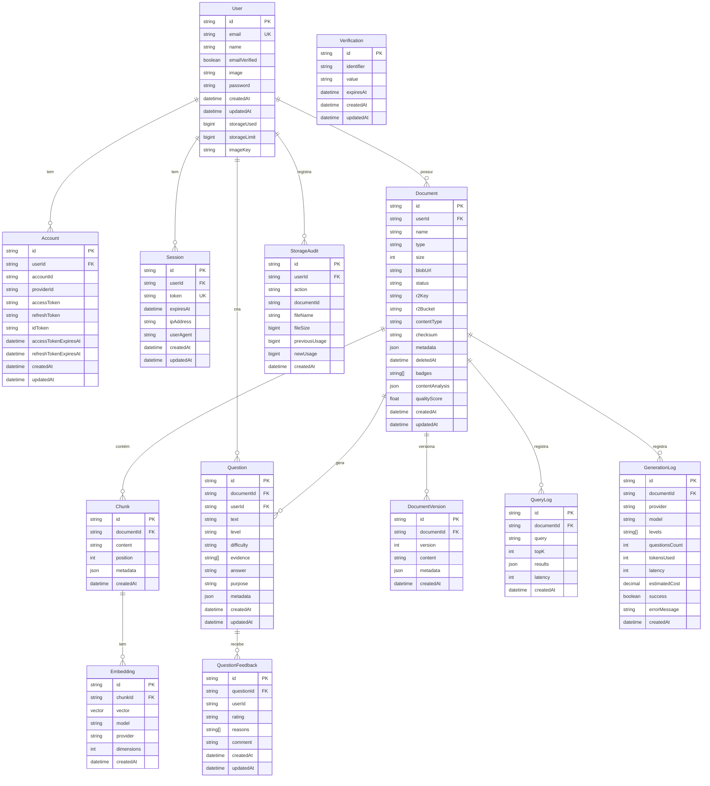

# Diagrama de Relacionamento de Tabelas (ERD)

Este diagrama mostra o modelo de dados completo do Questioning Agent, incluindo todas as tabelas, seus atributos principais e relacionamentos.

## Descrição dos Relacionamentos

### Autenticação e Usuários
- **User → Account**: Um usuário pode ter múltiplas contas OAuth (1:N)
- **User → Session**: Um usuário pode ter múltiplas sessões ativas (1:N)

### Gestão de Documentos
- **User → Document**: Um usuário pode ter múltiplos documentos (1:N)
- **Document → Chunk**: Um documento é dividido em múltiplos chunks (1:N)
- **Document → DocumentVersion**: Um documento pode ter múltiplas versões (1:N)
- **Chunk → Embedding**: Cada chunk tem embeddings (1:N para diferentes modelos)

### Geração de Questões
- **Document → Question**: Um documento gera múltiplas questões (1:N)
- **User → Question**: Um usuário cria múltiplas questões (1:N)
- **Question → QuestionFeedback**: Uma questão pode receber múltiplos feedbacks (1:N)

### Logging e Auditoria
- **Document → QueryLog**: Logs de consultas RAG no documento (1:N)
- **Document → GenerationLog**: Logs de gerações de questões (1:N)
- **User → StorageAudit**: Auditoria de uso de storage (1:N)

## Enums do Sistema

### DocumentStatus
- `UPLOADING`: Upload em andamento
- `PROCESSING`: Processando (chunking, embeddings)
- `INDEXED`: Indexado e pronto para uso
- `FAILED`: Falha no processamento

### CognitiveLevel (Taxonomia de Bloom)
- `REMEMBER`: Recordar fatos e conceitos
- `UNDERSTAND`: Compreender ideias
- `APPLY`: Aplicar em novas situações
- `ANALYZE`: Analisar conexões
- `EVALUATE`: Avaliar decisões
- `CREATE`: Criar trabalho original

### QuestionDifficulty
- `EASY`: Fácil
- `MEDIUM`: Médio
- `HARD`: Difícil

### QuestionPurpose
- `CREATION`: Para brainstorming e desenvolvimento
- `EVALUATION`: Para avaliação e testes

### FeedbackRating
- `LIKE`: Feedback positivo
- `DISLIKE`: Feedback negativo

### FeedbackReason
- `OUT_OF_CONTEXT`: Fora do contexto
- `INCORRECT_ANSWER`: Resposta incorreta
- `POORLY_FORMULATED`: Mal formulada
- `WRONG_COGNITIVE_LEVEL`: Nível cognitivo errado
- `DUPLICATE`: Duplicada
- `OTHER`: Outro motivo

## Índices para Performance

### User
- `email` (unique)

### Account
- `(providerId, accountId)` (unique)
- `userId`

### Session
- `token` (unique)
- `userId`

### Document
- `userId`
- `status`
- `r2Key`
- `deletedAt`

### Chunk
- `documentId`
- `position`

### Embedding
- `(chunkId, model)` (unique)
- `chunkId`
- `provider`

### Question
- `documentId`
- `userId`
- `level`
- `difficulty`
- `purpose`

### QuestionFeedback
- `(questionId, userId)` (unique)
- `questionId`
- `rating`
- `createdAt`

### QueryLog
- `documentId`
- `createdAt`

### GenerationLog
- `documentId`
- `provider`
- `createdAt`

### StorageAudit
- `userId`
- `createdAt`

---

**Projeto Acadêmico - TCC**  
Questioning Agent | UNIP 2025
