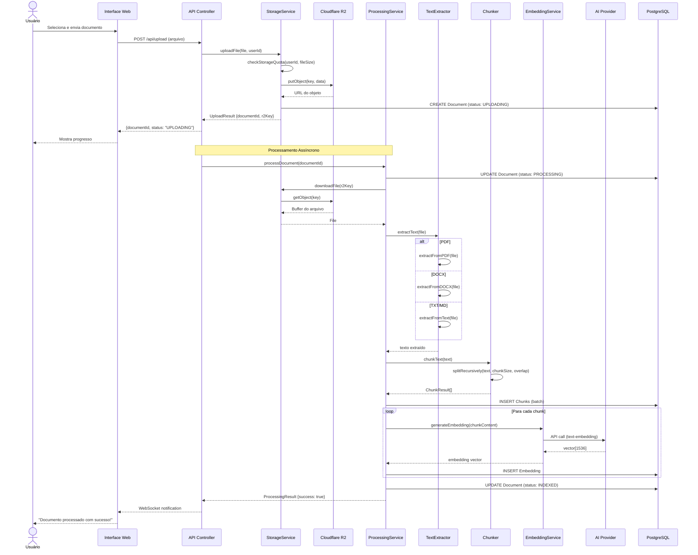
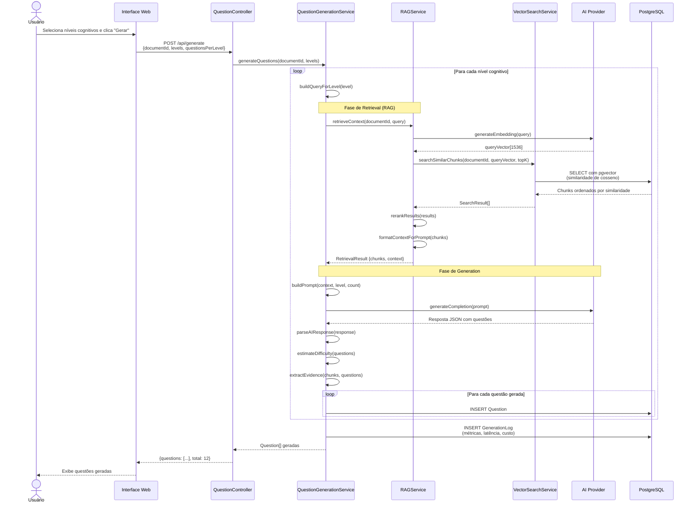
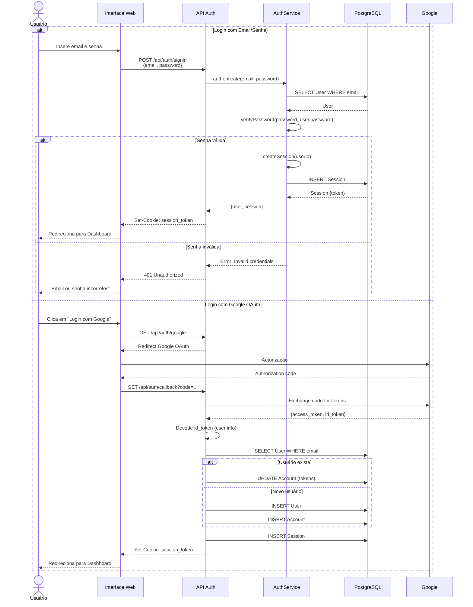
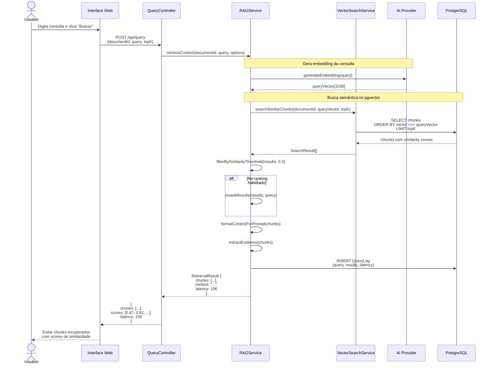
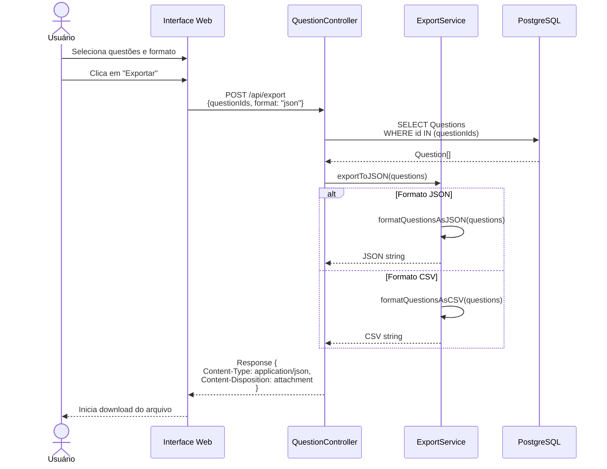
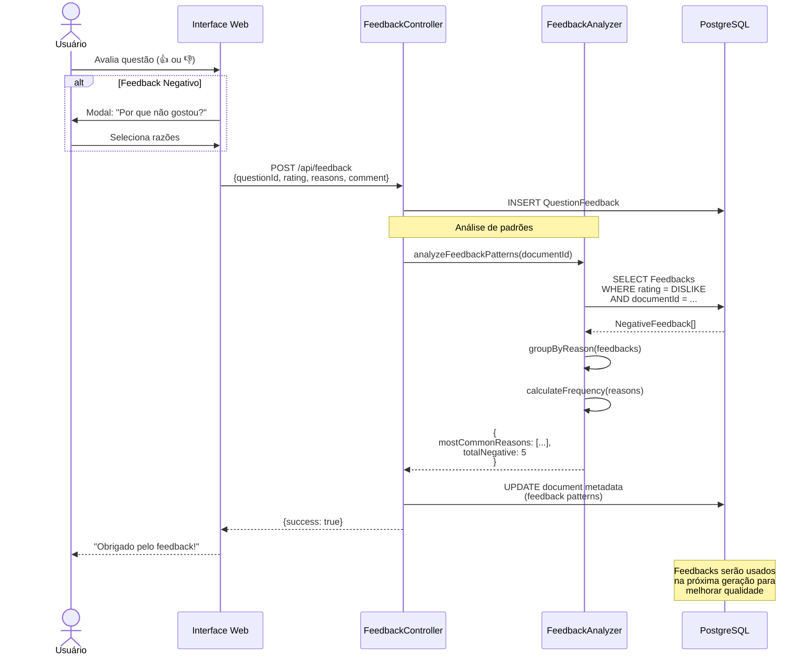

# Diagramas de Sequência

Este documento contém os principais fluxos do sistema representados em diagramas de sequência.

## 1. Fluxo de Upload e Processamento de Documento

## 2. Fluxo de Geração de Questões (RAG)

## 3. Fluxo de Autenticação

## 4. Fluxo de Consulta RAG (Query Tester)

## 5. Fluxo de Exportação de Questões

## 6. Fluxo de Feedback de Questões

## Notas Importantes

### Performance
- Processamento de documentos é **assíncrono**
- Embeddings são gerados em **batch**
- Cache de embeddings por modelo/provedor
- Índices pgvector para busca rápida

### Segurança
- Todas as requisições autenticadas por session token
- Validação de ownership (userId) em todas operações
- Rate limiting em APIs de IA
- Sanitização de inputs

### Escalabilidade
- Uso de Server Components do Next.js
- Streaming de respostas quando possível
- Paginação de resultados
- Connection pooling no PostgreSQL

### Resiliência
- Retry automático em chamadas de IA (max 3 tentativas)
- Fallback entre provedores de IA
- Tratamento de erros em todas camadas
- Logs detalhados para debugging

---

**Projeto Acadêmico - TCC**  
Questioning Agent | UNIP 2025
